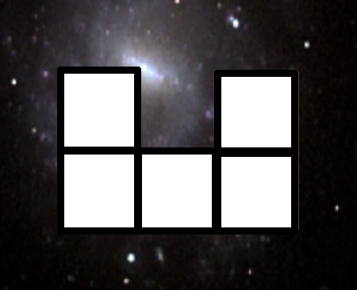

# OOP Shape generator

In this challenge, the goal is to create the model layer to improve the base of a tetris game
to generate randomly different shapes.

Each shape will contain a list of Rect called shape_list.

Here, the U shape has 5 units (5 rectangles objects composing it, [See doc](https://www.pygame.org/docs/ref/rect.html))

In the tetris game, we want to implement the following shapes (U, S, Bar, Square).

We want to generate a random shape on the fly when the previous one is at the bottom of the screen.
We also want to choose randomly to generate either a normal shape (U, S, Bar, Square) or a combined shape (Combination of two shapes, for example U + Bar, Bar + S, etc ...)

I let some hints in the code directly to guide the process.
You will have to explore the current code to find what is expected!

This will reuse the different OOP concepts seen during the previous exercise.

Good Luck!

If you manage to fix all the tests, you should get the expected results.
[Expected Result](https://www.youtube.com/shorts/9T9sakJH5mU)
